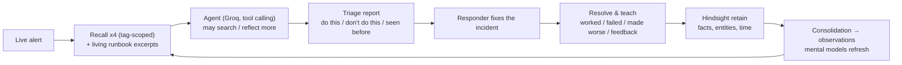

# NeverTwice — the on-call copilot that remembers every incident

[](https://github.com/SomeswararaoTellakula/nevertwice/actions/workflows/tests.yml)

**NeverTwice** triages production alerts using your team's incident history. It is built on
[Hindsight](https://github.com/vectorize-io/hindsight) agent memory, so it remembers every past incident: the log signature, the
root cause, the fix that worked, and — just as important — the fixes that **didn't** work or made things worse.

> An on-call engineer gets paged at 11:06 IST: *checkout-api 5xx 13.7%, HikariCP connection timeouts*.
>
> **Without memory** (gpt-oss-120b, real run): *raise the connection pool to 80, restart the pods* — and it cites
> "INC-2025", an incident that doesn't exist. At 12 pods that's 960 connections against a 500-connection database: the
> exact outage the team already had in INC-2104.
>
> **With Hindsight memory** (same model, same prompt): verifies the connection budget first, cuts back the new reconcile
> workers, terminates idle-in-transaction sessions, cites INC-2104, INC-2291, INC-2317 and INC-2282, and lists scaling to
> 20 replicas and changing the database instance under **Don't do this**. When the model still slips in a fix that failed
> before, the **backfire guard** checks it against memory and moves it out of the plan.

Same model, same prompt. The only difference is memory.

**Measured** (4 alerts × 3 runs, graded against per-alert checklists by `scripts/eval_alerts.py`, 29 Sept 2026):

| | Passed | Recommended a fix that already failed |
| --- | --- | --- |
| With Hindsight memory | **11 / 12** | 1 / 12 |
| Without memory | 2 / 12 | 10 / 12 |

The name is the promise: **the same outage should never cost you twice.**

---

## Why this problem

Most outages are repeats. The knowledge to fix them exists, scattered across postmortems nobody reads at 2 AM, and it
walks out of the door when the engineer who fixed it last time is asleep, on leave or gone. Incident tools store history;
none of them *use* it while you are being paged. Every minute of a SEV1 at a quick-commerce company costs real orders.

NeverTwice turns incident history into working memory:

| Without memory | With Hindsight memory |
| --- | --- |
| Generic advice ("restart, scale out") | The fix that actually worked last time, with the incident ID |
| Repeats past mistakes | A **Don't do this** list of fixes that failed or backfired, with evidence |
| No idea what's different this time | Notices what changed (new deploy, new DB role, new node group) and says what to verify |
| Forgets everything after the chat | Every resolution is retained, so the next similar alert is answered from experience |

## What you can do in the app

- **Triage** an alert with memory, or **compare** it side by side against the same model without memory.
- Watch the **look-back timeline**: an amber sweep through six months of incidents shows which ones the agent recalled and
  which it cited as evidence, and an impact strip counts memories recalled, incidents cited and backfired fixes flagged.
  Every incident ID is a clickable chip that opens the full postmortem; IDs the model invents are flagged in red.
- **Resolve & teach**: record what worked, what didn't and what made it worse. NeverTwice retains it into Hindsight and the
  next similar alert recalls it — the live learning moment of the demo.
- **Ask memory**: free-form questions answered by Hindsight `reflect` ("Which fixes have backfired on us, and why?").
- **Runbooks & memory**: living runbooks (Hindsight mental models) that re-write themselves as incidents are consolidated,
  the bank's directives, and a fact browser.
- **Backfire guard**: after the model answers, every risky step (restart, scale out, raise a timeout, change database
  limits, …) is checked against Hindsight; steps that failed before for the same service are moved to *Don't do this* with
  a "caught by guard" badge and the incidents that prove it.
- **Learning**: answer-quality scores with vs without memory (graded checklists per alert), a replay that measures how
  often the real fix appears as memory grows, and responder feedback collected in the app.

---

## How Hindsight memory is used

Memory is the whole product, so every major Hindsight capability has a job:

| Hindsight feature | How NeverTwice uses it | Code |
| --- | --- | --- |
| **Memory bank + mission + disposition** | One bank per on-call team. Mission says what to remember; disposition is skeptical (4) and literal (4) so exact identifiers and outcomes are preserved. | `memory.py` → `setup_bank` |
| **Per-operation missions** | `retain_mission` tells extraction to keep incident IDs, commands, flags and each fix's *outcome*; `observations_mission` guides consolidation. | `memory.py` |
| **Retain** (async, with `timestamp`, `context`, `tags`, `metadata`, `document_id`) | Each postmortem is stored as separate items per outcome (`outcome:worked`, `outcome:failed`, `outcome:made_worse`) plus change-log and convention items. Stable `document_id`s make re-seeding an upsert, not a duplicate. | `dataset.py`, `scripts/seed_memory.py` |
| **Recall** (semantic + keyword + graph + temporal) | Four recalls run in parallel for every alert: similar incidents, fixes that worked (tag-scoped), fixes that failed or backfired (tag-scoped), and on-call rules. Results are numbered `M1..Mn` so the model can cite them. | `memory.py` → `gather_context` |
| **Mental models** ("living runbooks") | *Recurring failure patterns*, *Fixes that backfired*, *Open postmortem action items*, *On-call rules*. Created with `refresh_after_consolidation`, so they update themselves after new incidents; the relevant excerpts are fed to triage. | `memory.py` → `setup_mental_models` |
| **Directives** | Hard rules for reflect: cite incident IDs, flag destructive actions as needing approval, separate what worked from what backfired. | `memory.py` → `DIRECTIVES` |
| **Reflect** | Powers *Ask memory* and the agent's `ask_incident_memory` tool; returns the evidence it used (`based_on`). | `memory.py` → `ask` |
| **Observations** | Hindsight consolidates repeated facts ("rolling restarts of checkout-api relapse") into observations that recall and reflect use automatically. | server-side |
| **Experience facts** | When a responder rates NeverTwice's recommendation, a feedback item ("I recommended X; it was wrong; the real fix was Y") is retained so the bank learns about its own advice. | `dataset.py` → `resolution_memory_items` |
| **Operations API** | Async retains are polled to completion so the UI can say exactly when new knowledge is recallable. | `hindsight_client.py` → `wait_for_operations` |

### The learning loop



### Architecture

```
nevertwice/
  hindsight_client.py   Async REST client for Hindsight (Cloud or self-hosted); retries, 422 fallbacks, op polling
  memory.py             Memory layer: bank setup, recall plan, runbook excerpts, reflect, retain-and-wait
  agent.py              Triage agent: memory vs baseline, tool loop, salvage/JSON fallbacks, evidence verification
  llm.py                OpenAI-compatible client hardened for Groq (429 waits, model fallback, tool_use_failed)
  dataset.py            Seed data → retain items; resolutions → retain items
  schemas.py            Pydantic models (alerts, reports, resolutions)
  server.py             Starlette API + Server-Sent Events for live progress
  store.py              Local UI bookkeeping (triage log, live incidents) — Hindsight is the memory
  static/               The UI (vanilla JS, no build step)
data/                   BasketBolt: company, 15 postmortems, change log, 6 live alerts
scripts/                seed_memory.py · check_setup.py · eval_alerts.py · eval_learning_curve.py · check_secrets.py
start.sh                one-command setup + start (macOS/Linux)
tests/                  72 tests with a faithful fake Hindsight server and a scriptable fake LLM (run in CI)
```

---

## Quick start (10 minutes)

**Requirements:** Python 3.10+, a Hindsight Cloud account (or self-hosted Hindsight), and a Groq API key.

**Fastest (macOS/Linux):** get the two keys below, then `./start.sh`. It creates the virtual environment, installs
dependencies, creates `.env` for your keys, checks the connection and starts the app. Load the memory once with
`python scripts/seed_memory.py` (the script tells you when).

1. **Get keys**
   - Hindsight Cloud: sign up at <https://ui.hindsight.vectorize.io>, create an API key. In *Billing*, add promo code
     `MEMHACK99` for $50 of credit.
   - Groq: <https://console.groq.com/keys> (free tier).

2. **Install**

   ```bash
   git clone https://github.com/SomeswararaoTellakula/nevertwice.git
   cd nevertwice
   python -m venv .venv
   # macOS/Linux:  source .venv/bin/activate
   # Windows:      .venv\Scripts\activate
   pip install -r requirements.txt
   cp .env.example .env        # Windows: copy .env.example .env
   ```

   Put `HINDSIGHT_API_KEY` and `LLM_API_KEY` in `.env`.

3. **Check the setup**

   ```bash
   python scripts/check_setup.py
   ```

4. **Load the incident history into Hindsight** (≈3–6 minutes: Hindsight extracts facts from ~63 items)

   ```bash
   python scripts/seed_memory.py
   ```

5. **Run**

   ```bash
   python run.py
   ```

   Open <http://127.0.0.1:8000>.

**Self-hosted Hindsight instead of Cloud:**

```bash
docker run -it --pull always --name hindsight -p 8888:8888 -p 9999:9999 \
  -e HINDSIGHT_API_LLM_PROVIDER=groq -e HINDSIGHT_API_LLM_API_KEY=$GROQ_API_KEY \
  -v hindsight-data:/home/hindsight/.pg0 ghcr.io/vectorize-io/hindsight:latest
```

Then set `HINDSIGHT_BASE_URL=http://localhost:8888` and leave `HINDSIGHT_API_KEY` empty.

## The 3-minute demo

Full script with timings: [`docs/DEMO_SCRIPT.md`](docs/DEMO_SCRIPT.md). Likely judge questions:
[`docs/JUDGING.md`](docs/JUDGING.md). Submission form answers and final checklist: [`docs/SUBMISSION.md`](docs/SUBMISSION.md).
Before pushing to GitHub, run `python scripts/check_secrets.py` to make sure no API key is outside `.env`.

1. **ALT-501, Compare with no memory.** Left: generic restart/scale advice. Right: INC-2104 and INC-2291 cited, restarts and
   scaling in *Don't do this*, the new DB role spotted. The timeline lights up the incidents it looked back at.
2. **Click an incident chip** to show the months-old postmortem the recommendation came from.
3. **ALT-505 (never seen before).** Memory has nothing matching, so confidence is low and the advice is general.
   **Resolve & teach** with the suggested resolution; watch Hindsight extract the facts.
4. **ALT-506 (same failure, new node).** NeverTwice now recalls the incident you just taught it and gives the exact fix.
5. **Runbooks & memory**: the *Fixes that backfired* runbook, maintained by Hindsight.
6. **Learning**: the replay curve (run `python scripts/eval_learning_curve.py --baseline` once beforehand).

Presenter notes for each alert are hidden by default; open <http://127.0.0.1:8000/?notes=1> while rehearsing.

To rehearse again from a clean slate: `python scripts/seed_memory.py --reset`.

## Backfire guard

The model can still suggest a fix that memory says failed before (in live testing, gpt-oss-120b recommended a
rolling restart of checkout-api even after recalling that restarts relapsed in INC-2104 and INC-2291). So after the
model answers, NeverTwice checks every risky step (restart, scale out, raise a timeout, database limit changes, cache
eviction, retry jobs, provider switches) against Hindsight: it recalls failed and working fixes of that kind for the
same service, and when failures outnumber successes it moves the step to **Don't do this** with the incidents that prove
it. Memory doesn't just inform the answer — it vetoes known-bad steps. Code: `agent.py` → `backfire_guard`.

## Scoring answer quality

```bash
python scripts/eval_alerts.py --baseline --runs 3
```

Each demo alert has a checklist in `data/alert_checks.json`: steps it must recommend, known-bad steps it must not
recommend, and incidents it should cite. The script triages each alert several times with and without memory, grades
every answer and prints pass rates (saved to `runtime/alert_eval.json`). Use it before and after changing prompts,
models or recall settings. Triage never writes to Hindsight, so it's safe to run on your demo bank.

Latest run (gpt-oss-120b on Groq, Hindsight Cloud, 29 Sept 2026):

| Alert | With memory | Without memory | Without memory, typically |
| --- | --- | --- | --- |
| ALT-501 checkout HikariCP timeouts | 3/3 | 0/3 | raised the connection pool size (INC-2104 outage) |
| ALT-502 NovaPay UPI timeouts | 3/3 | 0/3 | raised the PSP timeout (INC-2150 outage) |
| ALT-503 Kafka consumers crash-looping | 3/3 | 0/3 | reset offsets / added replicas; never found the DLQ skip |
| ALT-504 DNS timeouts on new nodes | 2/3 | 2/3 | scaled CoreDNS (failed in INC-2305) |

The one memory miss is honest: scaling CoreDNS worked in INC-2160 and failed in INC-2305, so the guard (which only
vetoes a fix when failures outnumber successes) lets it through and the model has to weigh the conditions itself.

## Measuring the learning curve

```bash
python scripts/eval_learning_curve.py --baseline
```

The replay uses a separate bank (`<bank>-eval`). It walks the 15 historical incidents in date order; for each one it
triages the incident *before* it is remembered (with and without memory), scores whether a top-2 recommended action contains
the fix that actually resolved it (`fix_keywords` in `data/incidents.json`), then retains it. Results appear in the
**Learning** tab. Three incidents are recurring failure modes (INC-2233, INC-2266, INC-2291); those are the ones where
memory should matter most. The metric is deliberately simple and keyword-based — see *Limitations*.

## Engineering for a live demo

Free-tier LLMs fail in predictable ways. NeverTwice is built so the on-call engineer always gets an answer:

- **Rate limits (429):** waits for `retry-after` (bounded), then switches to `LLM_FALLBACK_MODEL` (separate quota).
- **Invalid tool calls** (Groq `tool_use_failed`): the report is salvaged from `failed_generation`; otherwise retried,
  then regenerated in JSON mode.
- **Prompt too large (413):** memory context is compressed and retried.
- **Unsupported parameters** on other OpenAI-compatible providers are dropped automatically.
- **Hindsight hiccups:** each recall is independent — one failing degrades gracefully instead of failing the triage;
  optional request fields fall back on 422; async operations are polled with timeouts.
- **Hallucinated evidence:** every incident ID in a report is checked against what memory actually returned; unknown IDs
  are shown in red as unverified.
- **Token budget:** four compact recalls + runbook excerpts keep a triage prompt around 3K tokens, inside Groq's free tier.

## Tests

```bash
python -m unittest discover -s tests -v
```

The tests run offline against `tests/fakes.py`: an in-memory Hindsight server that returns only fields documented in the
Hindsight API reference, and a scriptable OpenAI-compatible endpoint that simulates rate limits, malformed tool calls,
oversized prompts and auth errors. They cover the full learning loop: triage a novel alert → resolve it → the next
similar alert recalls the new incident.

## The data

BasketBolt is a fictional 10-minute grocery delivery company in Hyderabad. The dataset (`data/`) is synthetic but written
the way real postmortems are: 15 incidents over six months across seven services (Spring Boot/HikariCP, Go payments with UPI
PSPs, Kafka consumers, Redis GEO, OpenSearch, SMS with TRAI DLT templates, EKS/CoreDNS), real-shaped log lines, timelines,
root causes, action items left open, and deliberately tricky nuance — restarts that failed in several incidents but were
the right fix once (INC-2340), and a remembered fix that did *not* apply the next time (INC-2317). All company, people, vendor and
customer details are invented.

## Path to adoption

1. Import existing postmortems (Confluence, Jira, Google Docs) with the same retain schema as `scripts/seed_memory.py`.
2. Receive alerts from a PagerDuty or Grafana webhook instead of the demo inbox.
3. Post each triage into the incident's Slack channel; **Resolve & teach** becomes a Slack button.
4. One Hindsight bank per on-call team with tags per service; self-hosted Hindsight where logs can't leave the network.

## Limitations and honest notes

- The learning-curve score is keyword matching against the known fix; it can miss a correct answer phrased differently.
- Hindsight fact extraction and consolidation take seconds to minutes; a just-resolved incident is recallable once its
  retain operation completes (the UI waits for it), while observations and runbooks catch up after consolidation.
- NeverTwice recommends; it does not execute commands. Commands shown should be reviewed like any runbook step.
- Local UI state (`runtime/`) is single-user; the memory itself lives in Hindsight and is shared by everyone using the bank.

## Configuration

| Variable | Default | |
| --- | --- | --- |
| `HINDSIGHT_BASE_URL` | `https://api.hindsight.vectorize.io` | Cloud, or `http://localhost:8888` |
| `HINDSIGHT_API_KEY` | – | Required for Cloud |
| `HINDSIGHT_BANK_ID` | `basketbolt-oncall` | |
| `LLM_BASE_URL` | `https://api.groq.com/openai/v1` | Any OpenAI-compatible API |
| `LLM_API_KEY` | – | |
| `LLM_MODEL` | `openai/gpt-oss-120b` | |
| `LLM_FALLBACK_MODEL` | `openai/gpt-oss-20b` | Used on rate limits/errors |
| `LLM_REASONING_EFFORT` | `low` | gpt-oss only |
| `HOST` / `PORT` | `127.0.0.1` / `8000` | |

## Links

- Hindsight: <https://github.com/vectorize-io/hindsight> · docs <https://hindsight.vectorize.io/>
- What is agent memory: <https://vectorize.io/what-is-agent-memory>

## Team

<!-- Add your team name and members here, with links to each member's article and post. -->

## License

MIT — see [LICENSE](LICENSE).
